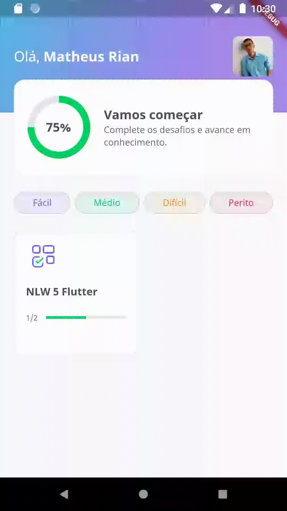

<h1 style="font-family: roboto;" align='center'>Dev Quiz ❔</h1>

<h1 style="font-family: roboto;" align='center'>
  </img>
  </img>
  </img>
</h1>

<h1 style="font-family: roboto" align='center'>
  </img>
</h1>


### :pushpin: Objective

<p style="font-family: roboto;">Project developed at NLW-05 on the Flutter trail. The goal was to create an application in one week using the Dart language.</p>

### :rocket: Getting Started

This project is a starting point for a Flutter application.

A few resources to get you started if this is your first Flutter project:

- [Lab: Write your first Flutter app](https://flutter.dev/docs/get-started/codelab)
- [Cookbook: Useful Flutter samples](https://flutter.dev/docs/cookbook)

For help getting started with Flutter, view our
[online documentation](https://flutter.dev/docs), which offers tutorials,
samples, guidance on mobile development, and a full API reference.

### :rocket: Installing and running

```bash

# Clone the project:
$ git clone https://github.com/Matheus-Rian/Dev-Quiz.git

# Enter the directory:
$ cd Dev-quiz
```
### 🏁 Features 

- [X] Interface
- [X] Animations
- [X] Integration Mock api
- [X] Quiz

### ⚒️ Technology

The following tools were used in the construction of the project:

- [Flutter](https://flutter.dev/)
- [Dart](https://dart.dev/)
---
### :trident: Author 

<a href="https://www.linkedin.com/in/matheus-rian-19b81a183/">
 
 <br />
 <sub><b>Matheus Rian</b></sub></a> <a href="https://www.linkedin.com/in/matheus-rian-19b81a183/" title="MatheusRian">🚀</a>


Made with ❤️ by Matheus Rian :point_right: Get in touch!

[](https://www.linkedin.com/in/matheus-rian-19b81a183/) [](souzamatheusrian@gmail.com)